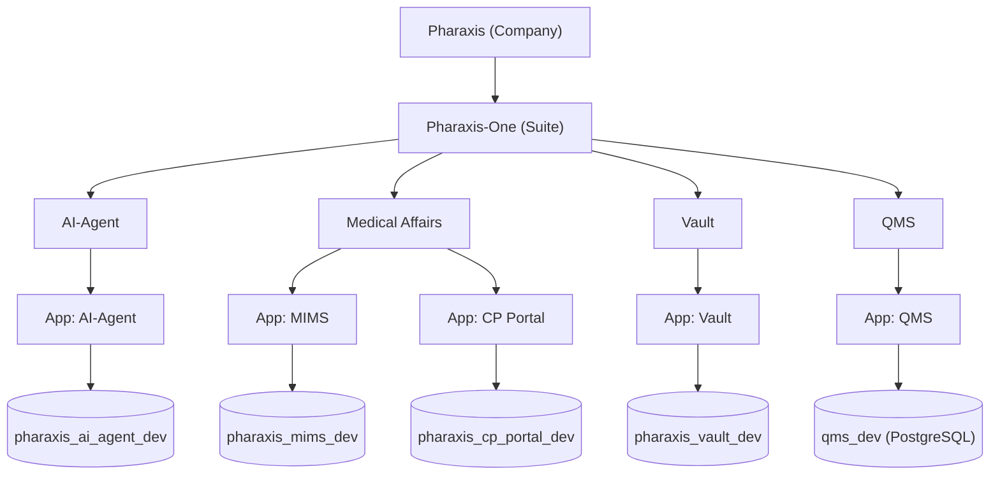
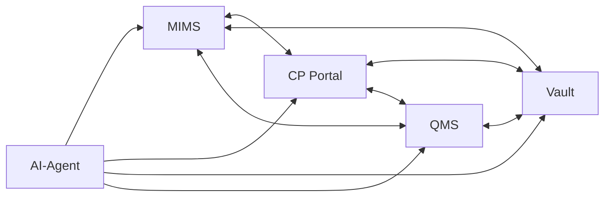

# Architecture Overview

## Enterprise Hierarchy

Pharaxis is the company.  
Pharaxis-One is the product suite under Pharaxis.

Within Pharaxis-One:
- 5 active applications: `MIMS`, `CP Portal`, `AI-Agent`, `Vault`, `QMS`
- Each application has its own dedicated database

## Integration Architecture

## App And Database Registry

| Application | Path | Database | Status |
|---|---|---|---|
| AI-Agent | `apps/ai-agent` | `pharaxis_ai_agent_dev` | Active |
| MIMS | `apps/mims` | `pharaxis_mims_dev` | Active |
| CP Portal | `apps/cp-portal` | `pharaxis_cp_portal_dev` | Active |
| Vault | `apps/vault` | `pharaxis_vault_dev` | Active |
| QMS | `apps/qms` | `qms_dev` (PostgreSQL, via `DATABASE_URL`) | Active |

## Integration Rules (Locked)

- AI-Agent can integrate with any application in the Pharaxis-One suite.
- MIMS and CP Portal can integrate with each other.
- MIMS and CP Portal can integrate with QMS and Vault.
- QMS and Vault can integrate.

## Data And Platform Standards

- DB platforms: MySQL 8+ and PostgreSQL 14+.
- DB isolation: one DB per application.
- Naming standard: MySQL services use `pharaxis_<app>_dev`; QMS uses `DATABASE_URL` (default local DB `qms_dev`).
- Environment contract: MySQL services use `MYSQL_*`; QMS uses `DATABASE_URL`.
- Runtime secrets: provided via `.env` and never committed.
