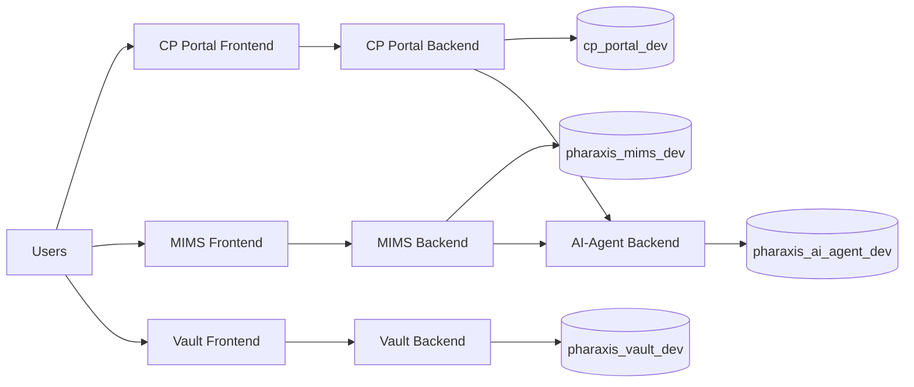

# Architecture Overview

## Topology

Pharaxis-One uses a multi-service, monorepo architecture where each app owns its own backend service and database schema while sharing common operational standards.

## Service Boundaries

### MIMS
- Path: `apps/medical-affairs/mims`
- Core focus: case management, admin control surfaces, reporting, integrations.
- Backend default port: `3000`

### CP Portal
- Path: `apps/medical-affairs/cp-portal`
- Core focus: admin + public portal endpoints, content, submissions, notifications.
- Backend default port: `4000`
- Frontend default port: `5174`

### AI-Agent
- Path: `apps/ai-agent`
- Core focus: AI provider routing, org-level key configuration, query handling.
- Backend default port: `6000`

### Vault
- Path: `apps/vault`
- Core focus: auth + superadmin + content vault foundations.
- Backend default port: `5000`

## Data Model Strategy

- MySQL is used across all active services.
- Each service uses a dedicated database name to keep schema ownership clear.
- Tables are initialized in application bootstrapping (`CREATE TABLE IF NOT EXISTS`).

See `docs/DB_DETAILS.md` for exact DB names and env mapping.

## API Versioning and Health

- MIMS exposes `/api/health` and `/api/version`.
- CP Portal exposes `/api/health`.
- Vault exposes `/api/health`.
- AI-Agent exposes `/api/v1/agent/health`.

## Operational Principles

- CI/CD and dependency updates are managed under `.github/`.
- Security-sensitive runtime values are provided through `.env` files and must never be committed.
- Runtime-generated storage artifacts are excluded from source control.
