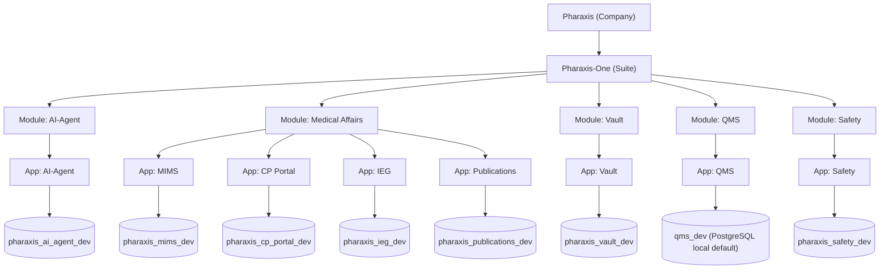
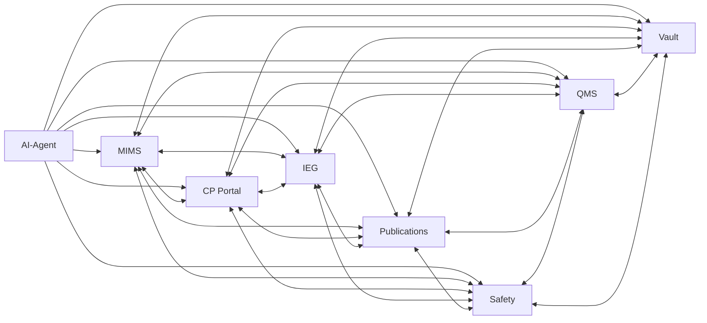

# Architecture Overview

## Enterprise Hierarchy

Pharaxis is the company.  
Pharaxis-One is the product suite under Pharaxis.

Within Pharaxis-One:
- 5 modules: `AI-Agent`, `Medical Affairs`, `Vault`, `QMS`, `Safety`
- 8 applications total
- each application has its own dedicated database
- QMS Sprint 1 and Safety Sprint 1 + 2 are implemented in this repository

## Integration Architecture

## App And Database Registry

| Module | Application | Path | Database | Status |
|---|---|---|---|---|
| AI-Agent | AI-Agent | `apps/ai-agent` | `pharaxis_ai_agent_dev` | Active |
| Medical Affairs | MIMS | `apps/medical-affairs/mims` | `pharaxis_mims_dev` | Active |
| Medical Affairs | CP Portal | `apps/medical-affairs/cp-portal` | `pharaxis_cp_portal_dev` | Active |
| Medical Affairs | IEG | `apps/medical-affairs/ieg` | `pharaxis_ieg_dev` | Planned/Scaffold |
| Medical Affairs | Publications | `apps/medical-affairs/publications` | `pharaxis_publications_dev` | Active (Sprint 1 kickoff baseline) |
| Vault | Vault | `apps/vault` | `pharaxis_vault_dev` | Active |
| QMS | QMS | `apps/qms` | `qms_dev` (PostgreSQL, configurable via `DATABASE_URL`) | Active (Sprint 1 complete) |
| Safety | Safety | `apps/safety` | `pharaxis_safety_dev` | Active (Sprint 1 and Sprint 2 complete) |

## Integration Rules (Locked)

- AI-Agent can integrate with any application in the Pharaxis-One suite.
- Medical Affairs applications can integrate with each other.
- Medical Affairs applications can integrate with QMS, Safety, and Vault.
- QMS and Vault can integrate.
- Safety and Vault can integrate.
- Safety and QMS can integrate.

## Data And Platform Standards

- DB platforms: MySQL 8+ and PostgreSQL 14+.
- DB isolation: one DB per application.
- Naming standard: MySQL services use `pharaxis_<app>_dev`; QMS uses `DATABASE_URL` (default local DB `qms_dev`).
- Environment contract: MySQL services use `MYSQL_*`; QMS uses `DATABASE_URL`.
- Runtime secrets: provided via `.env` and never committed.
